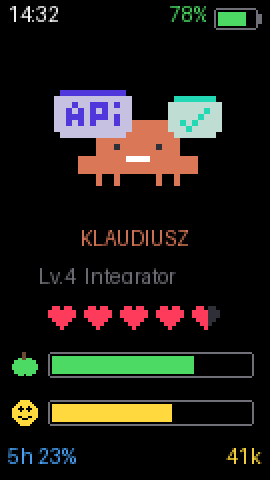
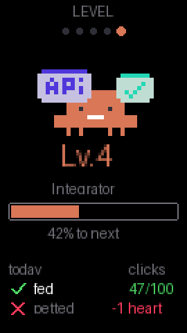
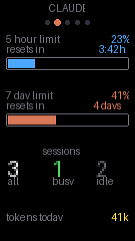
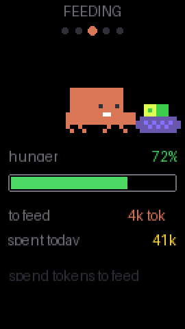
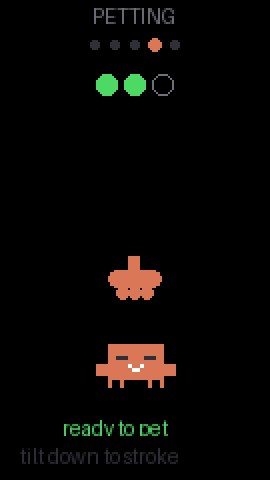
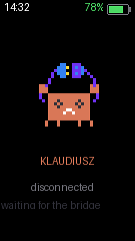
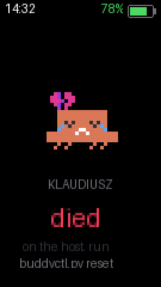
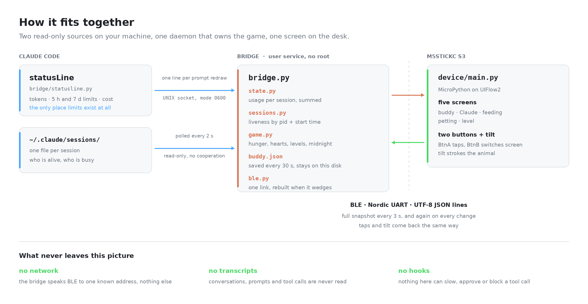

# cc-tamagochi

A Tamagotchi that lives on an M5StickC S3 and feeds on your Claude Code usage.

Spend tokens and it eats. Leave the machine idle overnight and it wakes up
hungry. Pet it once an hour, level it up, and it grows from a bare little
creature into one with a rocket. Neglect it for a few days and it dies — and
only you can bring it back.

<p align="center">
  
  &nbsp;&nbsp;
  
  &nbsp;&nbsp;
  
</p>

Nothing is flashed over the stock firmware: this is MicroPython running on top
of UIFlow2, so the device stays a normal M5StickC S3 that you can put back to
work at any time.

---

## What you need

- An **M5StickC S3** running UIFlow2 (any recent version; tested on v2.4.5)
- **Linux** with Bluetooth — the bridge uses BlueZ
- **Claude Code**, on a Pro or Max plan if you want the rate-limit bars
- [`uv`](https://docs.astral.sh/uv/) and [`mpremote`](https://docs.micropython.org/en/latest/reference/mpremote.html)
  (`uv tool install mpremote`)

## Install

```bash
git clone https://github.com/<you>/cc-tamagochi
cd cc-tamagochi
./deploy.sh
```

That uploads the artwork to the stick, sets up the host environment and runs the
tests. It finishes by printing a `statusLine` block — **add it to
`~/.claude/settings.json`** as a new top-level key, beside `hooks`:

```json
"statusLine": {
  "type": "command",
  "command": "/usr/bin/python3 /path/to/cc-tamagochi/bridge/statusline.py"
}
```

This is the only way the buddy learns how many tokens you have spent and how
much of your rate limit is left; those numbers exist nowhere else on disk.

Then name the pet, start the bridge as a background service, and put the app on
the stick:

```bash
./deploy.sh config               # four questions, with recommendations
./deploy.sh service              # runs at login, restarts on failure
cd device && ./deploy_app.sh     # so the stick runs without a terminal
```

`deploy_app.sh --autostart` also makes the board boot straight into the buddy
instead of the UIFlow2 menu. If you would rather keep it as a normal UIFlow2
device, skip that flag and run `./run.sh` from a terminal when you want the pet.

To survive logouts and reboots, allow the service to linger:

```bash
sudo loginctl enable-linger $USER
```

### Running the service

It is a systemd **user** unit, so none of this needs root:

```bash
systemctl --user status cc-tamagochi     # is it up, is it connected
journalctl --user -u cc-tamagochi -f     # follow the log
systemctl --user restart cc-tamagochi    # after any change under bridge/
systemctl --user disable --now cc-tamagochi
```

**A restart is what applies a change.** The daemon loads `buddy_config.json`
once at startup and holds the game in memory, so both editing the settings and
editing the code leave the running pet on the old rules until you restart it.
`./deploy.sh service` re-installs the unit file but will *not* restart a service
that is already active — it is `enable --now`, which does nothing to something
already running.

Nothing is lost in a restart: `buddy.json` is written every 30 seconds and read
back on startup, so hunger, hearts and level carry across. The stick shows the
pet as offline for a second or two and picks up again on the next heartbeat.

Changes to `device/main.py` are a different cycle entirely — `device/run.sh` for
a quick try, `device/deploy_app.sh` to write it to flash. The bridge does not
need to know.

## Using it

**BtnB** — the small button on the side — moves between five screens. The dots
under the title show where you are.

**BtnA** — the big one on the front — taps the buddy for a point of EXP on the
main screen. A hundred taps a day, then it politely declines.

### Buddy


Clock and battery along the top. The mascot's pose is its mood: working,
hungry, delighted, asleep, or the pose it has earned at its level.

**Five hearts** are its life. **The green bar is hunger**, the yellow one
**happiness**. Bottom corners: how much of your 5-hour limit is gone, and the
tokens you have spent today.

<br clear="right">

### Feeding



You do not feed it directly — **you feed it by working**. Every hour adds 2000
tokens to its appetite, and every token you spend in Claude Code pays that down.

`to feed` is how many tokens would fill the bar right now. Twelve idle hours
empty it completely, which is why it is always hungry in the morning.

<br clear="right">

### Petting



**Tilt the stick** to bring the paw down onto its head, then lift it away —
three times. The three dots at the top count your strokes.

Petting is always available and the buddy always reacts, but **only the first
petting each hour gives it happiness**. Happiness drains by 2% an hour, so it
wants attention roughly once an hour.

<br clear="right">

### Level


EXP comes from three places: tokens you spend, each petting, and taps on BtnA.
The mascot's pose on this screen is always the one for its level — it collects a
lightbulb, a keyboard, an API, an app, a server, then agents of its own, and
finally a rocket.

Below: **today's two goals**. Feed it and pet it at least once each day. Both
done at midnight earns half a heart. Missing either costs a whole one.

<br clear="right">

### Claude


Your 5-hour and 7-day limits as bars, each with how much is gone and how long
until it comes back — `3:42h` for the session window, `4 days` for the weekly
one. Below them: how many Claude Code sessions are alive, how many are busy, and
today's tokens. `--` instead of a percentage means the limit is not known yet:
it appears after the first API response of a session, and only on Pro and Max
plans. The countdown can be `--` on its own too, once a window has rolled over
and no status line has been drawn since.

<br clear="right">

### When something is wrong

<p>
  
  &nbsp;&nbsp;
  
</p>

If the bridge stops, the buddy says so and the buttons go quiet — every other
screen would be showing numbers that stopped being true.

If it runs out of hearts it dies, and stays dead until you bring it back:

```bash
./bridge/buddyctl.py status    # hearts, hunger, happiness, goals
./bridge/buddyctl.py reset     # start again
```

## The rules, in one table

| | |
|---|---|
| Hunger | +2000 tokens of appetite an hour; spending tokens feeds it. Empty after 12 idle hours |
| Happiness | +30% per petting, once an hour. −2% an hour otherwise |
| Hearts | 5. Both daily goals met at midnight: +½. Either missed: −1 |
| Daily goals | feed it at least once, pet it at least once |
| EXP | 1 per 5000 tokens, 20 per petting, 1 per tap (100 a day) |
| Levels | 100 EXP for the first, 35% more each time after |
| Death | 0 hearts. `buddyctl.py reset` is the only way back |

Every number here lives in [`bridge/buddy_config.json`](bridge/buddy_config.json)
and can be changed without touching code. The pet's name too.

### Making it yours

The defaults suit a steady day of ordinary use. If yours is not that, the
configurator asks four questions in plain language and does the arithmetic:

```bash
./deploy.sh config          # or: python3 bridge/configure.py
python3 bridge/configure.py --show    # what it is set to now
```

| It asks | It sets | Recommended |
|---|---|---|
| What is it called? | `name` | `KLAUDIUSZ` |
| Tokens on a normal day | `hunger.tokens_per_hour` — the daily figure ÷ 24 | 48k a day |
| Idle hours from full to starving | `hunger.hours_to_starve` | 12 h |
| Days of neglect it should survive | `life.penalty_missed_goals` — 5 hearts ÷ that many days | 5 days |

It reads today's real token count from a running bridge and shows it beside the
question, so the appetite can be anchored on your own day rather than on mine.
Nothing is written until you confirm a plain-English summary of the result, and
the previous file is kept as `buddy_config.json.bak`.

Two things it deliberately does not offer. **The number of hearts**: the device
draws five and takes no argument, so a six-heart pet would show five and lie
about its own health. **Anything about levels or petting**: those are in the
same file, they are just further from the questions anyone actually has.

The bridge reads the file once, at startup — `systemctl --user restart
cc-tamagochi` after changing it. The pet itself lives in `buddy.json` and
carries on across the change; only the rules move.

---

## For developers

### How it fits together

<p align="center">
  <picture>
    <source media="(prefers-color-scheme: dark)" srcset="docs/architecture-dark.png">
    
  </picture>
</p>

<sup>Regenerate with `python3 tools/diagram.py` after changing the data
flow.</sup>

The **bridge owns the game**; the device is a view with two buttons. The stick's
clock starts at 1970, `run.sh` restarts it constantly and nothing survives that
restart, so hourly decay, the midnight rollover and levels all live on the host
and persist to `buddy.json`.

The pet is **purely observational** — no blocking hooks, nothing that can slow a
tool call down. Two read-only sources cover everything:

| what | where from |
|---|---|
| rate limits, tokens, cost, context | the `statusLine` command's stdin |
| live sessions and busy/idle | `~/.claude/sessions/*.json` |
| wall clock | sent by the bridge on connect |

### What it can see, and what it cannot

You are pointing this at your own Claude Code, so here is the whole trust story
in one place. Every claim is one `grep` away, and the code says the same thing
in `bridge/bridge.py`'s docstring.

**It reads two things.** The numbers Claude Code hands its status line, and
`~/.claude/sessions/*.json` — an index of which processes are alive and whether
they are busy. Liveness is confirmed against `/proc/<pid>/stat`.

**It never opens a conversation.** Transcripts live under `~/.claude/projects/`
and nothing here touches them. Every file the daemon opens, in full — five
lines, and you can check them yourself:

```console
$ grep -rn "open(\|read_text" bridge/*.py | grep -v smoke
bridge/bridge.py:68:        with open(CONFIG_PATH) as handle:          # buddy_config.json
bridge/sessions.py:70:        with open(f"/proc/{pid}/stat", "rb")      # is this pid alive
bridge/sessions.py:111:            json.loads(path.read_text())         # a session index file
bridge/game.py:147:            with open(self.path) as handle:          # buddy.json, read
bridge/game.py:167:            with open(tmp, "w") as handle:           # buddy.json, written
```

**It cannot affect a tool call.** This is not a hook. Nothing in Claude Code
ever waits for the bridge: the status line writes to a socket with a 0.15 s
timeout and prints its line whatever happens, so a stopped or wedged daemon
means a stale pet and nothing more.

**Nothing leaves your machine.** The only dependency is `bleak`, there is no
HTTP client anywhere in `bridge/`, and the daemon's single outbound connection
is BLE to one hard-coded address. On disk it writes one file, `buddy.json`,
which holds counters — see `game.Snapshot` for its complete schema.

**No root.** `./deploy.sh service` installs a systemd *user* unit. The local
socket lives in `$XDG_RUNTIME_DIR` (0700) with mode 0600 on top.

The one honest caveat: **the BLE link is unencrypted and unpaired**, like most
hobby peripherals. Someone in radio range could connect to the stick while the
bridge is not, and read what the screen shows — hunger, hearts, tokens, how many
sessions are open. That is the whole vocabulary; `bridge/state.py::snapshot` is
the exhaustive list and carries no paths, names or content. They could also send
the two inputs the device accepts, and award your pet an undeserved petting.

### Layout

| | |
|---|---|
| `device/main.py` | one file: BLE peripheral, sprite renderer, five screens, tilt mini-game |
| `bridge/game.py` | hunger, happiness, hearts, levels, persistence |
| `bridge/state.py` | usage aggregation, mood and pose selection |
| `bridge/statusline.py` | one shot per prompt redraw, standard library only |
| `bridge/configure.py` | four questions to `buddy_config.json`, no venv needed |
| `tools/sprite_convert.py` | PNG → the device's sprite format |
| `tools/screenshot.py` | the images in this README, drawn by the real code |
| `tools/*_probe.py` | what this board can actually do, measured |

### Tests

```bash
cd bridge && python3 smoke.py
```

49 checks, no hardware: the status-line path end to end, usage aggregation, mood
and level selection, the daily rollover, the configurator's arithmetic, and that
every pose the code names has a sprite on disk. It runs happily alongside a live bridge — set
`CC_BUDDY_SOCKET` and it uses its own socket.

`tools/screenshot.py` is the other useful check: it renders every screen from
`device/main.py` itself, so a layout mistake is visible without a stick.

### Sprites

The converted sprites are committed, so this section only matters if you want to
change the artwork — drop the pack into `device/raw_images/` first, as its
[README](device/raw_images/README.md) describes.

The mascot art is pixel art upscaled by a non-integer
factor, which makes two things go wrong if you just resize it. Averaging blurs
2-colour art into mush, so the converter **samples the centre of each cell**
instead; and the grid phase differs per frame, so it fits each file to its own
grid rather than assuming a shared one.

The poses were also not drawn on a common baseline — the mascot sat at heights
spanning eleven pixels — so each frame is anchored on the largest connected blob
of `#D97757`, which is the animal itself and never a prop.

```bash
python3 tools/sprite_convert.py --png /tmp/preview   # look before uploading
python3 tools/sprite_convert.py --write device/sprites
```

`/tmp/preview/_sheet.png` shows every pose with a red feet baseline and a blue
spine. All 29 come to about 8.8 KB.

### The hardware, measured

Worth knowing before adding features, because `dir()` lies by omission —
several of these APIs accept calls and quietly do nothing:

| | |
|---|---|
| LED | **none.** `M5.Led.getCount()` is 0 and `M5.Power.setLed()` lights nothing |
| Vibration | **none** |
| Light sensor | **none** — a constant 0 in any lighting |
| Proximity sensor | works, `0`…`1792` |
| Speaker, IMU, battery | work |
| `M5.Rtc` | absent; `machine.RTC` works but starts at 1970 |
| Buttons | debounce themselves — use `wasClicked()`, not a hand-rolled timer |
| Fonts | nothing outside `0x20-0x7F`; a missing glyph draws as a box |

So the only output channels are the screen and the speaker, and every icon here
is drawn with primitives rather than typed.

Two MicroPython traps worth repeating: the GATT value buffer defaults to **20
bytes and truncates silently**, so `gatts_set_buffer` is not optional; and
`gatts_notify` sends one packet, dropping anything past the MTU rather than
fragmenting it.

Tilt axes are measured, not derived — `tools/tilt_probe.py` shows all three
axes live, which settles both the axis and its sign in one look.

---

## Credits

The mascot artwork comes from the **Claude Mascot Pack** by
[getillustrations.com](https://getillustrations.com/illustration-pack/claude-mascot-pack).
Everything the buddy looks like is their work; this project only rescales it and
draws it on a small screen.

**The source PNGs are not in this repository.** They are licensed to whoever
downloaded the pack, not to the repo, so `device/raw_images/` ships empty with
[instructions](device/raw_images/README.md) instead. What is committed is
`device/sprites/*.spr` — 29 two-colour bitmaps of about 8.8 KB in total, cut
down to 39 x 34 pixels for a 135 px screen. You need nothing else to run the
buddy; download the pack only to re-cut or change the artwork, and check its
terms before reusing it elsewhere.

The protocol groundwork came from Anthropic's
[claude-desktop-buddy](https://github.com/anthropics/claude-desktop-buddy), which
is what suggested putting Claude on a stick in the first place. None of its code
is used: this is a different idea on the same hardware.
